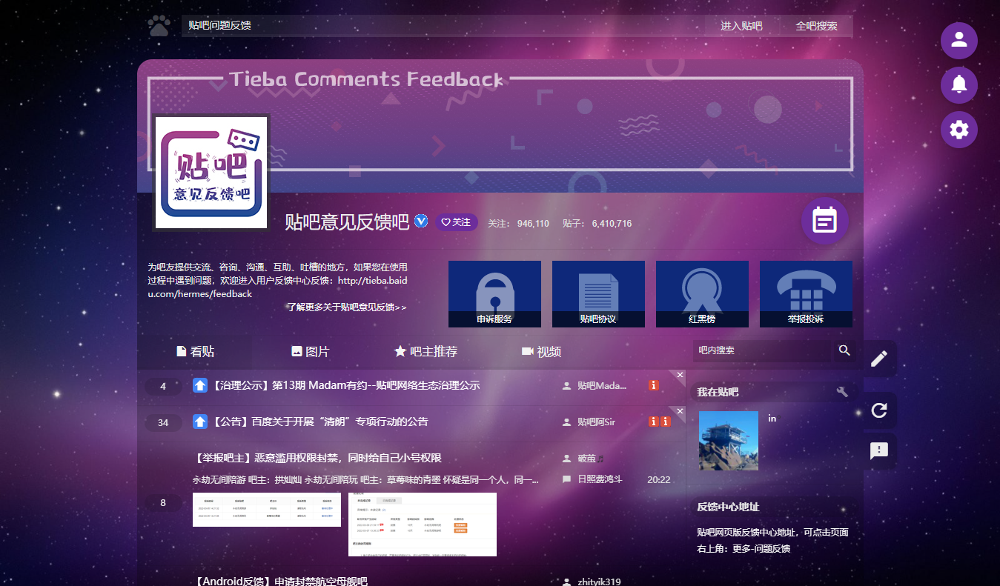

	

	

# 🦄 Tieba-Maverick-UserCSS
> 百度贴吧现代化风格样式

> 屎山一坨，随缘维护

## 使用方法
1. 安装 **Stylus 扩展**：[Chrome](https://chrome.google.com/webstore/detail/stylus/clngdbkpkpeebahjckkjfobafhncgmne), [Firefox](https://addons.mozilla.org/fr/firefox/addon/styl-us/)
2. [安装样式](https://raw.githubusercontent.com/imaverickk/Tieba-Maverick-UserCSS/master/tieba-maverick.user.css)

## 更多风格
>（需先安装主样式）
<table>
 	<tr>
  		<td align="center">
			<a href="https://raw.githubusercontent.com/imaverickk/Tieba-Maverick-UserCSS/master/custom-styles/silver-night.user.css">
				 SilverNight
			</a>
		</td>
   		<td align="center">
			<a href="https://raw.githubusercontent.com/imaverickk/Tieba-Maverick-UserCSS/master/custom-styles/purple.user.css">
				 Purple
			</a>
		</td>
 	</tr>
</table>